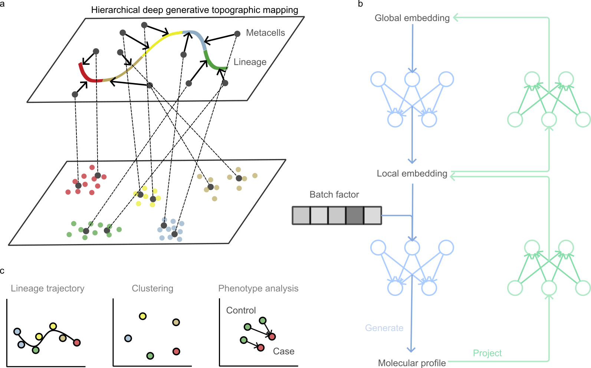

# HMAP: Hierarchical Manifold Approximation and Projection

HMAP develop a hierarchical deep generative topographic mapping algorithm to realize the recovery of both **global and local** manifolds underlying the given data.


<div align="center">
    
</div>

## Example
[HERE](./example)

## Metacell calling
HMAP also provides the supervised model, allowing the computation of global and local embeddings under the supervision of given metacells. For calling metacells, users can refer to [HERE](https://github.com/ZengFLab/SUREv2).

## Installation
1. Download HMAP and enter the directory
```bash
git clone https://github.com/ZengFLab/HMAP.git && cd HMAP
```

2. Create a virtual environment
```bash
conda env create -f environment.yml
```

3. Activate the created environment. 
```bash
conda activate HMAP
```

4. Install HMAP
```bash
pip install .
```